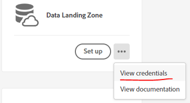
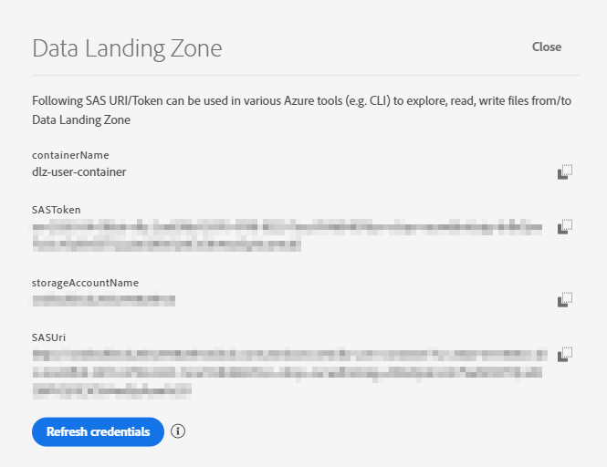
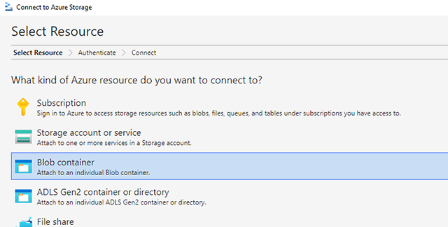
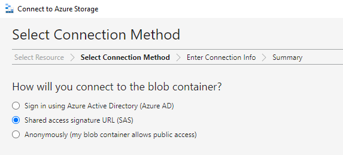
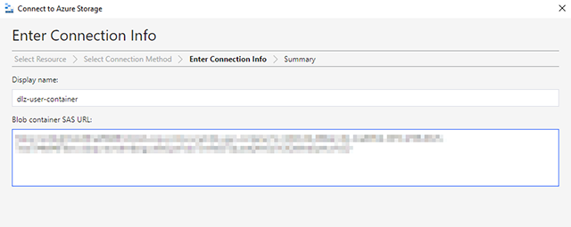
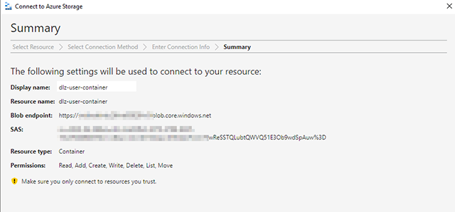
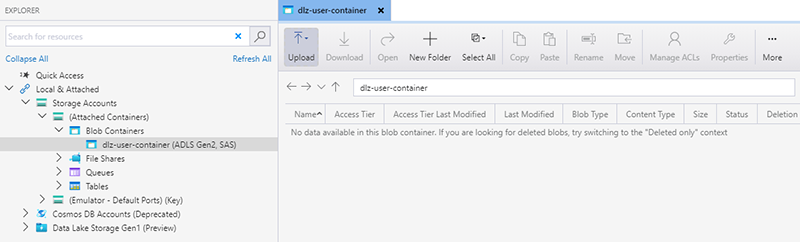
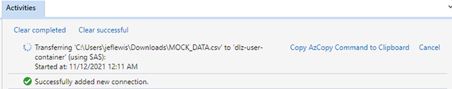
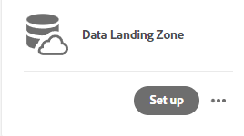
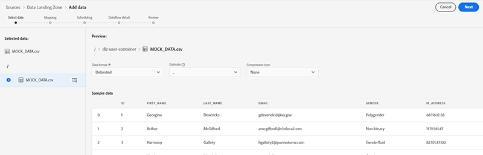

# Adobe Experience Platform: Data Landing Zone Examples

## What is Data Landing Zone?

Data Landing Zone (DLZ) is an Azure Blob storage interface provisioned by Adobe Experience Platform (AEP), granting you access to a secure, cloud-based file storage facility to bring files into Platform.

* One Data Landing Zone is available to each sandbox within AEP
* Total storage volume across all containers is limited to the total data provided with your AEP
products and services license
* Strict seven-day TTL is enforced - all files will be deleted automatically after seven days
* Generally supports any tooling or protocols that support SAS-based authentication to an Azure Storage Container
* Supports folders for organizing of files
* Names of files and folders are subject to Azure Storage naming constraints, as well as additional constraints unique to DLZ.
* [See the official AEP Data Landing Zone documentation for further details](https://experienceleague.adobe.com/docs/experience-platform/sources/connectors/cloud-storage/data-landing-zone.html?lang=en)

This method of file transmission can be particularly useful in situations where data destined for AEP is stored in a data center behind a restrictive access policy (i.e., SFTP connection throttling or file access frequency limitations), or the user lacks easy access to a cloud-based storage mechanism such as S3, Azure Blob, or Google Cloud Storage.

---

## Locating your Data Landing Zone Credentials

To locate your Data Landing Zone credentials, browse to the **Sources** menu in Adobe Experience Platform. Under the **Cloud Storage** subheading, look for **Data Landing Zone**. Click the ellipses next to *Set up* and click **View credentials**.



A dialogue will appear that shows the following elements:

* **containerName** - the name of the container within your Azure Storage Account that is utilized for Data Landing Zone functionality
* **SASToken** - SAS tokens are a special set of query parameters that indicate how storage resources may be accessed by a client, along with the actual signature used for authorization. You may see the following query parameters in the string:
  * sv - (Signed Version) specifies the version of Share Key authorization used by this SAS
  * si - (Signed Identifier) unique value up to 64 characters in length that correlates to an access policy specified for the container
  * sr - (Signed Resource) specifies which resources are accessible via the SAS (service, container, or object)
  * sp - (Signed Permission) specifies the signed permissions for the account SAS (read, write, delete, list, update, etc.)
  * sig - (Signature) signature that is used to authorize the request made with the SAS
* **storageAccountName** - the name of the specific storage account that contains your Data Landing Zone storage container. This name is globally unique within Azure
* **SASUri** - URI that contains the HTTPS endpoint for your storage account, concatenated with the SAS Token value. You will generally use this full URI when accessing Data Landing Zone

   

These settings should be treated as sensitive and stored in a credentials vault or similar secure location.

---

## Connecting Azure Storage Explorer to Data Landing Zone

[Azure Storage Explorer](https://azure.microsoft.com/en-us/features/storage-explorer/) is a free and easy UI-based way to manage the contents of your Data Landing Zone storage. After connecting the application to your Data Landing Zone storage container, you can upload new/updated files, delete old ones, create folders, etc.

To establish a connection between Azure Storage Explorer and Data Landing Zone, follow these steps:

1. Click the **Connect to Azure Storage** icon in the toolbar. When asked to select a resource, click **Blob Container**:

   

2. For **Connection Method**, select **Shared access signature URL (SAS)**:

   

3. Copy and paste the **SAS URI** that was listed in your Data Landing Zone's credentials screen. The **Display name** value will auto-populate from the SAS URI, or you can name it to whatever you would like:

   

4. Assuming all settings entered were correct, you should see a screen summarizing your connection. Click **Connect** to establish the connection:

   

5. If the connection was successful, you should see a storage accounts hierarchy similar to the below in Azure Storage Explorer. By default, "dlz-user-container" is the name of your Data Landing Zone container unless you altered the name in step 3:

   

6. Upload a test file to Data Landing Zone by either dragging a file to upload into the application window or using the **Upload** menu option. If the **Activities** status window reports file upload success, then your Data Landing Zone is ready to use (don't forget to delete the test file):

   

---

## Upload a file using PowerShell

* [DLZ_Upload_PowerShell.ps1](./src/DLZ_Upload_PowerShell.ps1)

This example uses the Azure "Az" PowerShell module to upload a single file to Data Landing Zone. This script can be expanded upon and altered to load multiple files, or perform other operations against Data Landing Zone (list, delete, etc.) - refer to the [Az module documentation](https://docs.microsoft.com/en-us/powershell/module/az.storage/?view=azps-6.6.0) for more information.

```PowerShell
<#
.Synopsis
   Upload a file to AEP Data Landing Zone 
.DESCRIPTION
   Uploads a single file from a local file store to an Adobe Experience Platform Data Landing Zone
.Prerequisites
   Ensure that the Az module is installed and that you're using PowerShell 7.1.3+
   Command to install Az module: 
      Install-Module -Name Az -Scope CurrentUser -Repository PSGallery -Force
.Author
    Jeff Lewis (jeflewis@adobe.com)
.CreatedOn
    2021-11-12
#>

# -----=====-----=====-----=====-----=====-----=====
# DLZ Container Settings
# -----=====-----=====-----=====-----=====-----=====
$containerName = "<DLZ CONTAINER NAME>"
$accountName   = "<DLZ ACCOUNT NAME>"
$sasToken      = "<DLZ SAS TOKEN>"

# -----=====-----=====-----=====-----=====-----=====
# File and Path Settings
# -----=====-----=====-----=====-----=====-----=====
$srcFilePath   = "<FULL PATH TO FILE>"
$srcFileName   = Split-path $srcFilePath -leaf

# -----=====-----=====-----=====-----=====-----=====
# Generate Storage Context and Upload File
# -----=====-----=====-----=====-----=====-----=====
$clientContext = New-AzStorageContext -SasToken $sasToken -StorageAccountName $accountName
$response      = Set-AzStorageBlobContent -File $srcFilePath -Container $containerName -Blob $srcFileName -Force -Context $clientContext
```

---

## Upload a file using Bash

* [DLZ_Upload_Bash.sh](./src/DLZ_Upload_Bash.sh)

This example uses Bash and [cURL](https://curl.se/) to upload a file to Data Landing Zone with the Azure Blob Storage REST API.

```Bash
#!/bin/bash
# -----=====-----=====-----=====-----=====-----=====-----=====
# Uploads a single file from a local file store to an Adobe 
# Experience Platform Data Landing Zone
#
# Author:     Jeff Lewis (jeflewis@adobe.com)
# Created On: 2021-11-12
# -----=====-----=====-----=====-----=====-----=====-----=====

# Set Azure Blob-related settings
DATE_NOW=$(date -Ru | sed 's/\+0000/GMT/')
AZ_VERSION="2018-03-28"
AZ_BLOB_URL="<URL TO BLOB ACCOUNT>"
AZ_BLOB_CONTAINER="<BLOB CONTAINER NAME>"
AZ_BLOB_TARGET="${AZ_BLOB_URL}/${AZ_BLOB_CONTAINER}"
AZ_SAS_TOKEN="<SAS TOKEN, STARTING WITH ? AND ENDING WITH %3D>"

# Path to the file we wish to upload
FILE_PATH="</PATH/TO/FILE>"
FILE_NAME=$(basename "$FILE_PATH")

# Execute HTTP PUT to upload file (remove '-v' flag to suppress verbose output)
curl -v -X PUT \
   -H "Content-Type: application/octet-stream" \
   -H "x-ms-date: ${DATE_NOW}" \
   -H "x-ms-version: ${AZ_VERSION}" \
   -H "x-ms-blob-type: BlockBlob" \
   --data-binary "@${FILE_PATH}" "${AZ_BLOB_TARGET}/${FILE_NAME}${AZ_SAS_TOKEN}"

```

---

## Upload a File Using Python

* [DLZ_Upload_Python.py](./src/DLZ_Upload_Python.py)

This example uses Microsoft's [Python v12 SDK](https://docs.microsoft.com/en-us/azure/storage/blobs/storage-quickstart-blobs-python) to upload a file to Data Landing Zone. We are using the full SAS URI to provide the most straightforward method of connecting to an Azure Blob Container, though there are other methods and options available in documentation linked above.

```python
# -----=====-----=====-----=====-----=====-----=====-----=====
# Uploads a single file from a local file store to an 
# Adobe Experience Platform Data Landing Zone using
# Python and the Azure Python v12 SDK.
# 
# Author:     Jeff Lewis (jeflewis@adobe.com)
# Created On: 2021-11-23
# -----=====-----=====-----=====-----=====-----=====-----=====

import os
from azure.storage.blob import ContainerClient

try:
    # Set Azure Blob-related settings
    sasUri = "<SAS URI>"
    srcFilePath = "<FULL PATH TO FILE>" 
    srcFileName = os.path.basename(srcFilePath)

    # Connect to container using SAS URI
    containerClient = ContainerClient.from_container_url(sasUri)

    # Upload file to Data Landing Zone with overwrite enabled
    with open(srcFilePath, "rb") as fileToUpload:
        containerClient.upload_blob(srcFileName, fileToUpload, overwrite=True)

except Exception as ex:
    print("Exception: " + ex.strerror)
```

---

## Upload a File Using AzCopy

* [DLZ_Upload_AzCopy.bat](./src/DLZ_Upload_AzCopy.bat)

This example uses Microsoft's [AzCopy utility](https://docs.microsoft.com/en-us/azure/storage/common/storage-ref-azcopy?toc=/azure/storage/blobs/toc.json) to upload a file to Data Landing Zone. While we're only using the [copy](https://docs.microsoft.com/en-us/azure/storage/common/storage-ref-azcopy-copy) command in this example, there are a number of other commands and options that the utility supports.

```cmd
@echo off

rem -----=====-----=====-----=====-----=====-----=====-----=====
rem Uploads a single file from a local file store to an 
rem Adobe Experience Platform Data Landing Zone using
rem the Azure AzCopy utility. Assumes you have PATH vars
rem set for AzCopy (otherwise path to azcopy.exe is 
rem required).
rem 
rem Note that certain characters in the sas URI (i.e., "%")
rem must be properly escaped.
rem 
rem Author:     Jeff Lewis (jeflewis@adobe.com)
rem Created On: 2021-11-21
rem -----=====-----=====-----=====-----=====-----=====-----=====

set sasUri=<FULL SAS URI, PROPERLY ESCAPED>
set srcFilePath=<PATH TO LOCAL FILE(S); WORKS WITH WILDCARD PATTERNS>

azcopy copy "%srcFilePath%" "%sasUri%" --overwrite=true --recursive=true
```

---

## Use Data Landing Zone in AEP as a Data Source

Once you have data loading into your Data Landing Zone, you can use it as a data source connector within AEP as if it were any other cloud-based storage data source.

1. In the **Sources** menu, locate **Data Landing Zone** under the **Cloud Storage** subheading. Click **Set up**:

   

2. You will be directed to the data source onboarding dialogue. Assuming you've uploaded data into files and/or folders, you should be able to select them for preview/parsing and proceed on to the mapping and scheduling options:

   

---

## Further Reading

* [Adobe Experience League > Data Landing Zone](https://experienceleague.adobe.com/docs/experience-platform/sources/connectors/cloud-storage/data-landing-zone.html?lang=en)
* [Azure Storage Explorer > Download](https://azure.microsoft.com/en-us/features/storage-explorer/)
* [Microsoft Docs > Delegate Access with a Shared Access Signature](https://docs.microsoft.com/en-us/rest/api/storageservices/delegate-access-with-shared-access-signature)
* [Microsoft Docs > Quickstart: Upload, download, and list blobs with PowerShell](https://docs.microsoft.com/en-us/azure/storage/blobs/storage-quickstart-blobs-powershell)
* [Microsoft Docs > Quickstart: Manage blobs with Python v12 SDK](https://docs.microsoft.com/en-us/azure/storage/blobs/storage-quickstart-blobs-python)
* [Microsoft Docs > Get started with AzCopy](https://docs.microsoft.com/en-us/azure/storage/common/storage-use-azcopy-v10)
* [Microsoft Docs > Service SAS Examples](https://docs.microsoft.com/en-us/rest/api/storageservices/service-sas-examples)
* [C-Sharp Corner > Demystifying SAS Tokens](https://www.c-sharpcorner.com/article/demystifying-sas-token-basics/)
